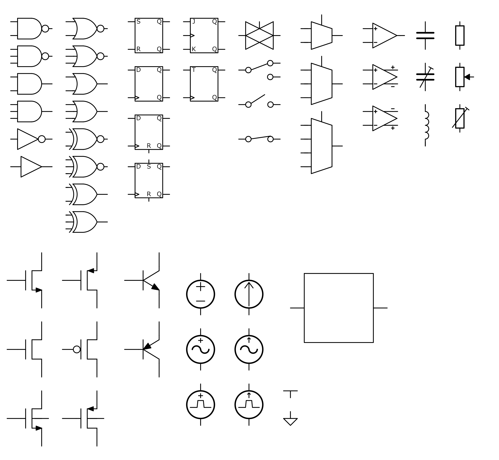

# KiCad_Drafting_Symbols

KiCad7 用回路図シンボルです。  
サイズや見た目に統一感のある回路図を作ることができます。  
論文等、人に見せる用の回路図を作るときに使うことを想定しています。  
CMOS回路を描くのに便利なシンボルが多く含まれます。  

## 使い方  
[Drafting_Symbols.kicad_sym](Drafting_Symbols.kicad_sym) をシンボルライブラリに登録するだけです。  
[Drafting_Symbols.kicad_sym](Drafting_Symbols.kicad_sym) を Document/KiCad/7.0/symbols にコピーし、KiCadの設定からシンボルライブラリを追加してください。  
詳しいKiCadの使い方は[公式ドキュメント](https://docs.kicad.org/7.0/ja/kicad/kicad.html)等を参照してください。  

## 使用例  
回路図エディターの表示オプション でフォントをArialに変更しています。  
出力モードをモノクロにしてプロットしています。  
  
CMOSオペアンプ  
  
論理回路など  
  
シンボル一覧(2023/12/14時点)  